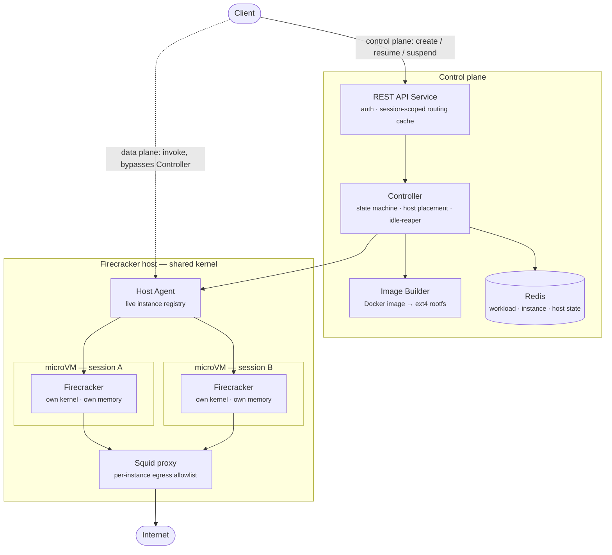

# Agentbox

Hardware-isolated, resumable compute for autonomous agents. Agentbox runs untrusted agent code in Firecracker microVMs — one dedicated kernel per session, suspended when idle and resumed transparently on the next request, with a durable per-instance volume that survives the suspend/resume cycle.

## Why microVMs, not containers

Containers share the host kernel; an attacker who breaks out of the application still shares that kernel with everything else on the box. Firecracker microVMs give each session its own kernel and its own memory space, isolated by the same CPU-level hardware boundary (KVM/Intel VT-x) a full VM gets — at roughly container-like boot times (~125ms) and memory overhead (<5 MiB), instead of the seconds and hundreds-of-MiB a traditional VM costs.

## Architecture

## Design decisions

- **Control plane / data plane split.** The REST API Service talks to the Controller only for lifecycle changes (create, resume, suspend, delete). Actual invocation traffic goes REST API Service → Host Agent → guest directly — the Controller is never in the hot path and never sees request/response bytes.
- **One dedicated VM per service.** REST API Service, the Controller/Image Builder/Redis control plane, and the Firecracker host are three separate machines, split by privilege: anything touching `mount`, loop devices, TAP, or `/dev/kvm` runs natively via systemd; everything else runs as an ordinary, unprivileged container.
- **Idle instances are reclaimed, not killed.** A Redis-backed idle-reaper suspends (Firecracker snapshot, not delete) any instance past its idle timeout, freeing host resources. The next invocation resumes it transparently — the client never sees the difference beyond one slightly slower request.
- **Durability is a volume, not a snapshot.** Every instance gets its own `home.ext4`, a second virtio-block device separate from the root filesystem, mounted at a fixed path and preserved across every suspend/resume cycle until the session is explicitly deleted.
- **One golden image, many private copies.** The Image Builder converts a workload's Docker image into an ext4 rootfs once; every session that runs it gets its own writable copy, since a writable root can't be shared across concurrent guests.

## Repo layout

| Path | What's there |
|---|---|
| `cmd/{apiservice,controller,hostagent,imagebuilder}` | Entry points for the four services above |
| `internal/apiservice` | REST API Service: auth, routing cache, invoke/session HTTP handlers |
| `internal/controller` | State machine, Redis-backed store, idle-reaper, placement |
| `internal/hostagent` | Firecracker lifecycle (boot/suspend/resume), networking, Squid |
| `internal/imagebuilder` | Docker image → ext4 rootfs pipeline |
| `internal/common`, `internal/config`, `internal/logging` | Shared types, env-based config, structured logging |
| `docker/` | Dockerfiles for the two containerized services |
| `infra/terraform` | GCP infrastructure for a three-VM deployment |
| `integration/` | Cross-service integration tests |

## Status

A working prototype, validated end-to-end on real GCP infrastructure (register → cold invoke → warm invoke → suspend → resume-on-invoke, with durable state proven across a real cross-machine round trip). Not yet hardened for production — security review is ongoing.

See [agentbox-sample-agent](https://github.com/Kishore712/agentbox-sample-agent) for a minimal guest application demonstrating the platform's guest-side contract.
